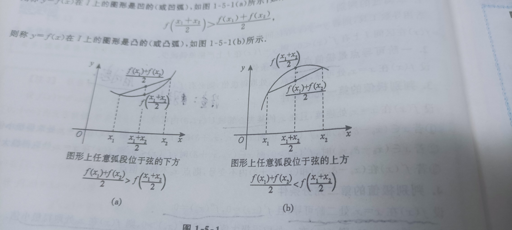

## 极值与最值定义：

**极值：**若存在$x_0$的某个领域，使得在该**邻域**内任意一点$x$，均有$f(x) \le f(x_0)$ 成立，则称$x_0$为广义极大值点，$f(x_0)$为广义极大值。

**最值：**若存在$x_0$的某个领域，使得在该**定义域**内任意一点$x$，均有$f(x) \le f(x_0)$ 成立，则称$x_0$为广义最大值点，$f(x_0)$为广义最大值。

## 极值的判别

设有函数$f(x)$在区间$I$上连续，针对$x_0$点判别极值点。其中**一个必要条件，三个充分条件**

必要条件：一阶可导必有$f'(x_0) = 0$

第一充分条件：$x_0$的邻域$U(x_0, \delta)$内可导，领域内左右导数相乘异号。

第二充分条件：$f'(x_0)=0, f''(x_0) \neq 0$, 若$f''(x_0)<0$,取得极大值，若$f''(x_0)>0$,取得极小值。

第三充分条件：$f(x)$ n阶可导，$f^{(n)}(x_0) \neq 0 (n \ge 2)$, 当n为偶数，若$f^{(n)}(x_0)<0$,取得极大值，若$f^{(n)}(x_0)>0$,取得极小值。

## 凹凸性和拐点：

**驻点定义**：连续曲线一阶导数为0的点，通常是单调发生变化的点。

**拐点定义**：连续曲线的凹弧和凸弧分界点称为拐点，二阶导数为0的点。

**判别凹凸性：**设函数$f(x)$在区间上二阶可导，若$f''(x)>0$，则$f(x)$在区间上是凹的；若$f''(x)<0$，则$f(x)$在区间上是凸的； **此处可以用$y=x^2$去记忆和推理。**

**判别拐点：** 一个必要三个充分条件。

必要条件： 二阶导数存在且$f''(x_0) = 0$

第一充分条件: $f(x)$在邻域$U(x_0, \delta)$内二阶导数存在，且左右邻域内$f''(x)$变号。

第二充分条件: $f(x_0)$三阶可导，且$f''(x_0) = 0, f'''(x_0) \neq 0$。

第三充分条件: $f(x)$ n阶可导，$f^{(n)}(x_0) \neq 0 (n \ge 3)$, 当n为奇数，若$f^{(n)}(x_0) \neq0 , (x_0, f(x_0))$为拐点。

## 渐近线

**倾斜渐进线：**若$\lim\limits*{x \to +\infty} \frac{f(x)}{x} = k_1, \lim\limits*{x \to + \infty} \[f(x) - k_1 x] = b_1$, 则$y = k_1x+b_1$是曲线的一条倾斜渐进线。 其余方向同理推导。

## 求最值：

求处$f(x)$的区间的所有驻点，不可导点和区间两端极限，最后比较出最大和最小的值。